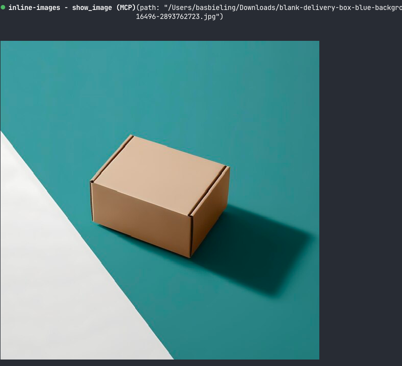
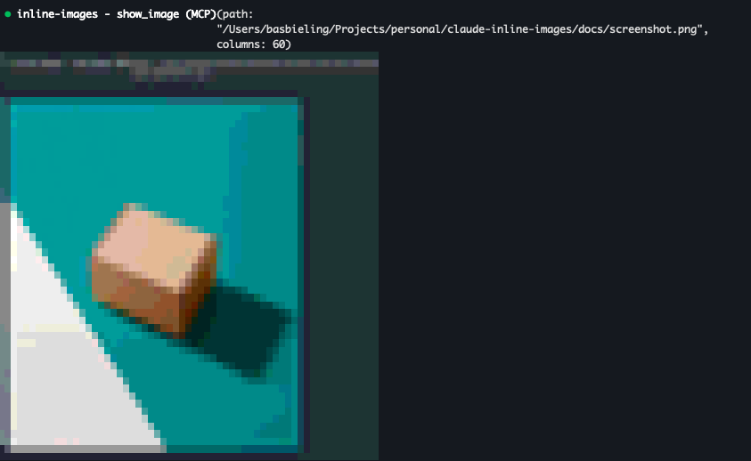

# claude-inline-images

A Claude Code mod that shows images inline in your terminal.

It gives Claude a `show_image` tool. When you ask Claude to show you an image, the tool draws the file in the
transcript. The image does not go into Claude's context. Claude uses `Read` when it must look at the image itself.

It also draws the images you paste into the prompt, under your message in the transcript.



Claude Code does not draw real images in iTerm2, so there the mod uses a fallback: colored half-block characters,
two pixels per cell.



## Install

At the prompt of a Claude Code session in the terminal, type:

```
/plugin install inline-images --marketplace Mechazawa/claude-inline-images
```

Answer `y` to add the marketplace, then select a scope. The tool is available from the next prompt.

## Usage

Ask Claude to show you a file:

```
show me ~/Downloads/screenshot.jpg
```

Claude calls `show_image` with these inputs:

| Input | Description |
| --- | --- |
| `path` | Absolute or working-directory-relative path of the image |
| `columns` | Width in terminal columns, 80 by default |

The image keeps its aspect ratio. It is never wider than the transcript and never taller than 40 rows.

### Pasted images

When you paste an image into the prompt, the mod draws it 40 columns wide under your message. Images pasted
before the mod was loaded are not drawn.

To turn this off, open `/config` and set `inline-images.showPastedImages` to `false`.

## Requirements

- Claude Code 2.1.275 or later.
- A terminal with 24-bit color. [Ghostty](https://ghostty.org) and [kitty](https://sw.kovidgoyal.net/kitty/) show the
  image at full resolution with the kitty graphics protocol. Other terminals, such as iTerm2, and all terminals inside
  tmux show the image as colored half-block characters, two pixels per cell.
- An image tool. The mod uses it to read the image size, to convert JPEG, GIF, WebP, HEIC and TIFF files to PNG for
  the kitty graphics protocol, and to convert images to BMP for the half blocks. It uses the first one it finds:
  1. `sips`, which macOS includes.
  2. [ImageMagick](https://imagemagick.org), version 6 or 7. On Linux, install it, for example with
     `sudo apt install imagemagick`. For HEIC files, also install `libheif-plugin-libde265`.
  3. [ffmpeg](https://ffmpeg.org) with `ffprobe`.

  Converted files go to `/tmp/claude-inline-images`.

## Development

Run Claude Code with the mod loaded from this folder:

```
claude --plugin-dir .
```

Check and test it:

```
claude plugin validate .
claude plugin test .
```

## License

[MIT](LICENSE)
